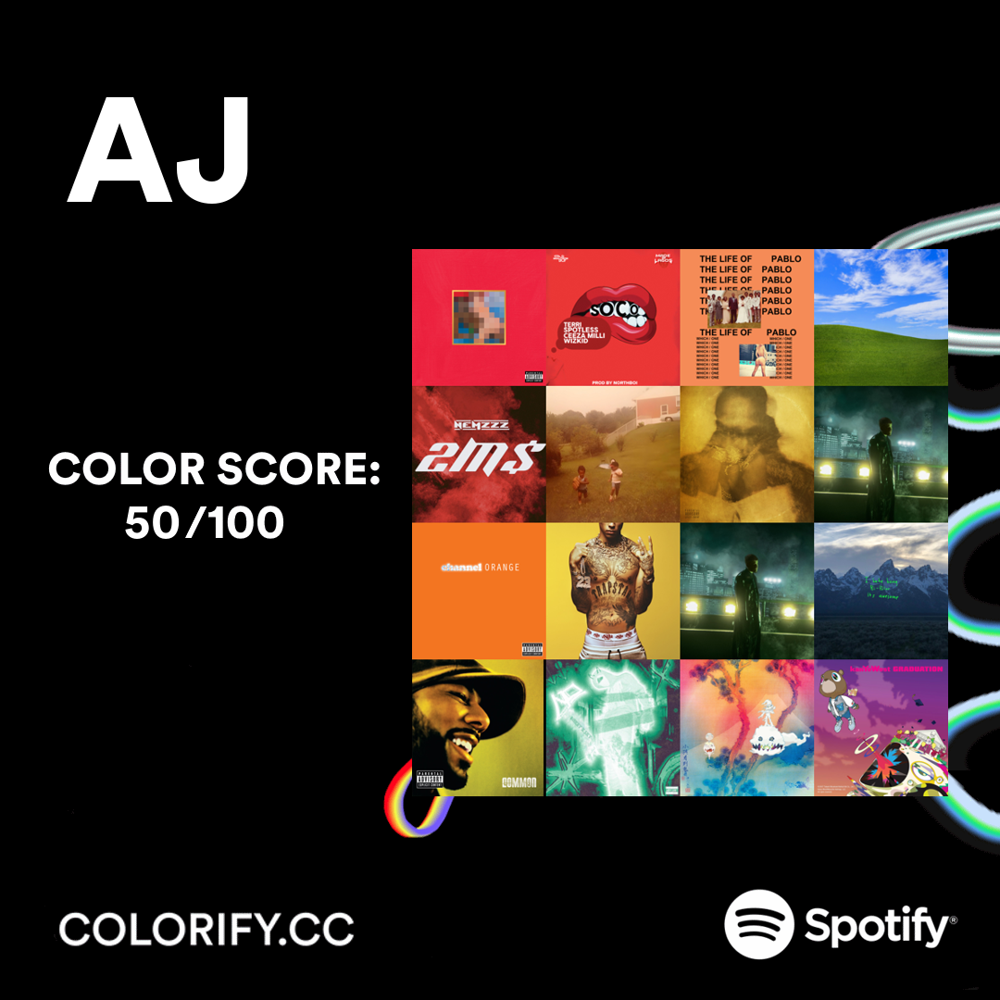

  <h1 align="center" style="font-size: 3em;">Colorify</h1>

  

    Web-App to create a rainbow palette collage based on your top-listed albums/tracks on Spotify and give you a score based on your colour variety in cover art.

<!-- ABOUT THE PROJECT -->
## About The Project

  

This Web-app is designed to give Spotify Users another way of showcasing their music taste with friends. This time with a colorful twist!

<!-- GETTING STARTED -->
## Getting Started

To use the Colorify app without local setup, follow these steps:

1. Create an app on the [Spotify Developer Dashboard](https://developer.spotify.com/dashboard/).
2. Set the Redirect URI to `http://3.17.158.254/callback`.
3. Visit [www.Colorify.cc](http://www.colorify.cc).
4. When prompted, enter the CLIENT_ID and CLIENT_SECRET from the app you created.

### Self-Hosting

If you prefer to run the web app locally, follow these steps:

1. Download the source code from [Colorify GitHub Repository](https://github.com/MashClashXD/Colorify).
2. Run `pip install -r requirements.txt` in the directory of the downloaded source code.
3. Follow the above steps to create an app on the Spotify Developer Dashboard, but set the Redirect URI to `http://localhost:5000/callback`.
4. Run `app.py`.
5. Connect to [http://127.0.0.1:5000](http://127.0.0.1:5000) to use the app.
6. When prompted, enter the CLIENT_ID and CLIENT_SECRET from the app you created on the Spotify Developer Dashboard.

(<a href="#readme-top">back to top</a>)

